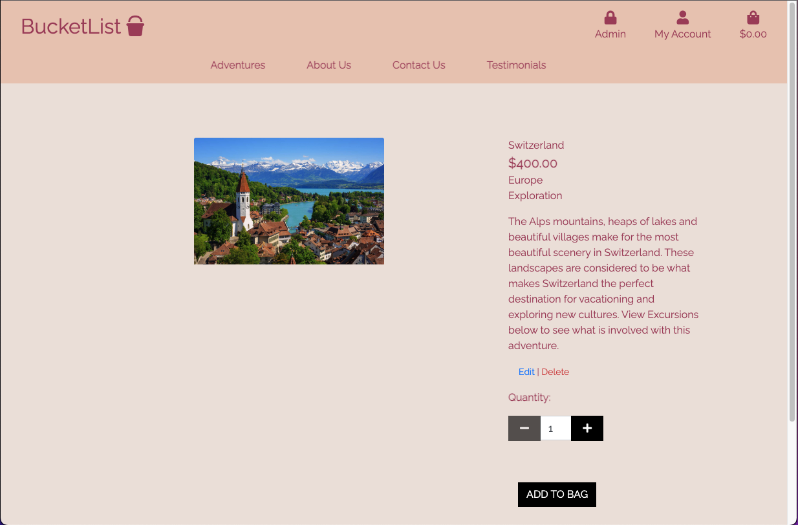
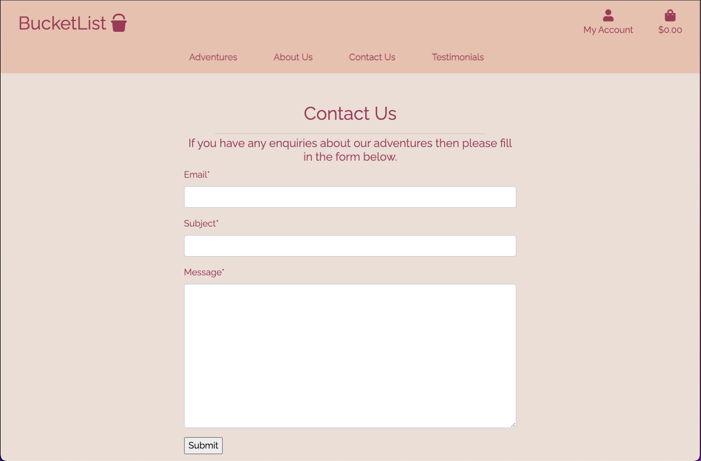
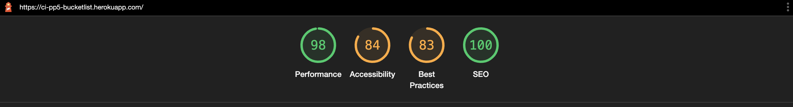

# BUCKETLIST
Live deployment for the app here https://ci-pp5-bucketlist.herokuapp.com/

# Project Overview

The main objective of the BucketList E-Commerce website is to provide a user-friendly platform for people to search for an adventure that suits them and to be able to purchase the advenutre securely. The target end user is anyone and everyone who is interested in an adventure, and who has a desire to travel and explore new places.

The e-commerce store has functionality that allows the user to add an adventure into a checkout bag, post testimonials, add adventures to a Wishlist to save for later, contact us directly for any enquiries. This access thereby permits the user to interact with the forum platform and take part in discussions. End users are able to: 

	- Add a adventure to the checkout bag.
	- Update their checkout bag.
	- Purchase a product through stripe payment.
	- Create, Read, Update and Delete testimonial posts.
    - Add or remove an adventure from their Wishlist.

Additionally, users have access to their profile, which provides them with an order history and the ability to save billing information to allow smooth purchases. 

When users decide to create a post, they are prompted to provide a unique title of their choosing, their post content, and an excerpt to contextualise their post.

Once the post has been created, it will published on the forum. Once the post is published, the user will be able to see them on the main post list page. From there the user will be able to edit and delete their posts.

BucketList is a Django framework app. The user's post data is stored in a database with PostgreSql, and the app is hosted on Heroku. The Django administration site was utilised to provide admin control in order to monitor forum content, as well as super user control of CRUD operations - including the ability to delete other users’ posts and comments.

Below is the link to the live website:

# Planning
## Scope
### Main Goals
The primary goals of the website admins are:
- To add, edit and delete adventures with all the relevant information, per the model.
- To be able to view orders and reviews in the admin panel.
- To be able to see and manage user reviews.

The primary goals of the website users are: 
- To register for an account on the website. 
- To sign in and sign out of the website. 
- To View a list of all adventures.
- To view adventure details.
- To purchase adventures for multiple persons.
- To post testimonials on past adventures they have been to, and be able to edit or delete it.
- To see their order history in their profile page.

## Strategy
### User Stories
The user stories were broken down into epics first which include technical, landing page, adventures, marketing, basket, checkout, testimonials and user profiles.
These were then broken down into 5 sprints where in each sprint covered 5 days and different user stories.
Each user story is broken down into their description and the acceptance criteria that needed to met for it to have been achieved.

Login details will be provided to assessor due to inability to share.

## Marketing
### Search Engine Optimization (SEO)
SEO is used as a tool for improving the quality and quantity of website traffic to the website targeting unpaid traffic rather than direct traffic or paid traffic.
WordTracker.com and Google Keyword Tracker are the tools used in this website. The keywords were inputted into these tools to gather the results for which keywords returned the highest traffic and lowest competition ideally.
Throughout the website SEO tools are used to increase the traffic to the website. These key words were the inputted into the meta data.
### Marketing Techniques
A facebook page was created to increase the websites exposure online and improve traffic to the website. This would allow users to follow the website on social media and gives an unpaid solution to improve marketing.
In addition the website includes a newsletter sign up for for users to keep updated with deals, and new adventure locations.
Chimp mail was used for this popup and the script included in the header code.
A mockup facebook page can be seen here 
### Business Model
With the BucketList project, the goal was to create a Minimum Viable Product (MVP) for a Tourism e-commerce site, operating on a Business to Consumer (B2C) business model, whereby we are selling a product directly to customers and thereby bypassing any third-party retailers and wholesalers.

#### Target Audience 

At its core, BucketList serves as a platform for anyone and everyone seeking an exotic escape, challenging adventure, or cultural tour, to find a trip that appeals to their desires and fulfils their dreams. The adventures on offer are those which would appear on any explorer’s bucket list, hence the name. 

Being a tourism e-commerce business, the target audience for BucketList is broad. However, as the idea is to specialise in once-in-a-lifetime, curated adventures to far-flung destinations, this creates a niche for those that can afford to embark on such excursions (in terms of time and money). The target audience, therefore, most likely falls into the following categories: 

People embarking on Gap Year adventures
People seeking adventures on their sabbatical
People who have retired and want to make the most of their new found freedom

The target audience is not limited to these groups, but these are the demographics who are most likely to have the time and money to be able to seek the adventures BucketList will have on offer.

#### Business Demand 

Tourism is a global industry with year-round demand. 

With the recent global lockdowns, and the severe impact this has had on the tourism industry, now that borders are open and travel is permitted, there is a massive demand for going on once-in-a-lifetime adventures. The goal with BucketList is to create an easy-to-use, hassle-free platform for customers to find curated adventures and book them, removing the stress that is typically involved in planning holidays. With this in mind, there is a particular emphasis on considered User Experience (UX), enabling clear navigation, profile management, content layout, and stress-free payment solutions.

#### Future Features

Looking forwards, with the BucketList application, there are plenty of avenues to expand on the offerings of the MVP. In future iterations and versions, I envision implementing the following additional features:

- Wish List / Bucket List - whereby a customer can maintain a list of their favourite destinations and adventures.
- Custom Adventures - whereby a customer can customise their adventure within the parameters of pre-defined options.

#### Partnerships

BucketList, as a business, will involve partnerships with tourism professionals in the destination countries, including local guides and operators.

Furthermore, there is demand to expand into the arena of Eco-Tourism, involving partnerships with charity missions abroad - further catering to the target demographics, and offering another facet of fulfilment.

#### Monetisation

The core principle of the BucketList e-commerce site is to offer a B2C business model, through the vessel of selling tourism adventures to customers. This involves making profits on the goods and services offered.

However, given the fact that BucketList is an e-commerce site, there is also the option to venture into monetising advertisement on the website, whereby driving traffic through to the sites of its advertising partners will generate additional income for the business.

## Design 
### Wireframes
Wireframes for the site were hand drawn.

## Structure 
### Website Pages
#### Index page non user/admin
This is the index page the first page users get to when the website is loaded up.

#### Index page signed in as admin
When signed in as the admin you can see an admin dropdown menu to deal with product management.

#### Adventures
This shows all the adventures unfiltered.

This is the advenutres page with a filter on it.

This is the adventures detail page with a link to view the specific excursion for the adventure.

#### Authorisation
This shows the authorisation pages needed for users to register and sign in and sign out.

After that they can access their profile page where they can prefill billing information and order history.

#### Admin 
The admin can add adventures and excursion.

The admin can view contact enquiries in the front end through their admin dropdown on the navigation bar.

!

#### Users
Users can submit contact forms and add testimonials that they can view on the testimonials page.]

Users can add adventures to bag and then checkout.

### Database diagrams 
Lucid chart was used to layout the database models used.

## Testing
### Manual Testing
For the manual testing, I referenced the User Story Acceptance Criteria that I defined in JIRA to frame the test cases. Testing from a user perspective, in line with the Acceptance Criteria, ensures the quality and functionality of the code, and assures the quality of the user experience.

### BUC-11
- AC1. The Landing Page should have a clear layout with a navigation menu so that the user understands how to navigate to their desired location within the application.
- AC2. The Landing Page should be aesthetically pleasing, with a harmonious colour scheme and clear images, in order to create a good impression to users and enhance user experience.

When a user navigates to the landing page, they are presented with a clearly presented page, which is aesthetically pleasing and not jarring.
There is a clear navigation menu which sensical navigation options, that are explicitly named and give me a clear understanding of the website’s layout and how to navigate between pages.
This functionality works for all user roles - logged in user, anonymous user, admin user.

#### BUC-12
- AC1. There should be a clearly presented main menu with navigation options which route to the different destinations within the application when clicked.

The main navigation menu on the landing page is clearly presented, with explicit navigation options.
All of the navigation links, when clicked, navigate the user to the intended page, as per the button label.
Within the pages of the application, there are explicit and functioning navigation buttons to re-direct me to different parts of the website, so that I can easily navigate to different sections of the site to view the content I want and perform the actions I wish to.
This functionality works for all user roles - logged in user, anonymous user, admin user.

#### BUC-14
- AC1. When the user navigates to the Adventure Dashboard, all of the product should be displayed clearly on the screen.
- AC2. The user should be able to view a title, description, price and image if there is one.
- AC3. There should be a navigation menu so that the user can navigate to different sections of the application from the Adventure Dashboard.

When a user navigates to Adventure Dashboard, the page is rendered clearly and they are presented with a clearly presented list of adventure options.
The products each have a brief label, description, price and image. The products are presented in such a way that is aesthetically pleasing and easy to read.
There is a navigation menu at the head of the adventure dashboard, allowing me to navigate to different sections of the app if I wish to.
This functionality works for all user roles - logged in user, anonymous user, admin user.

#### BUC-16
- AC1. When a user clicks on an adventure on the dashboard page, they should be navigated to a separate page with a more detailed view of the product.
- AC2. There should be a buttons that allows the user to navigate back to the adventure dashboard.
- AC3. There should be placeholder buttons for viewing any excursions associated with the adventure, and for modifying the quantity of the product and adding it to the basket.

When a user clicks on a product item on the adventure dashboard page, they are navigated to a separate, dedicated page with a more detailed view of the product.
There is a button called ‘Keep Shopping’ which navigates back to the adventure dashboard, and renders the page and loads the adventures.
There is a button for viewing excursions and trips included with the adventure, which when clicked navigates successfully to a separate, dedicated excursion page, and renders the products clearly as expected.
This functionality works for all user roles - logged in user, anonymous user, admin user.

#### BUC-17
- AC1. There should be a button that when clicked navigates to a page listing the excursions associated with an adventure destination.
- AC2. There should be a clear layout, displaying the excursions on the page, including a brief description and an image.

There is a button for viewing excursions and trips included with the adventure, which when clicked navigates successfully to a separate, dedicated excursion page, and renders the products clearly as expected.
The excursions are clearly presented on the page in the form of a list, each with a label, description and image.
This functionality works for all user roles - logged in user, anonymous user, admin user.

#### BUC-25
- AC1. Implement Admin user functionality for all CRUD functionality.
- AC2. Admin should be able to create adventure products.
- AC3. Admin should be able to edit adventure products.
- AC4. Admin should be able to view adventure products.
- AC5. Admin should be able to delete adventure products.

As an admin user, when I navigate to the adventure dashboard, the products are rendered and displayed clearly on the page.
Under each product, there is an edit and remove button.
When I click on the edit button, I am redirected to a form where I am able to edit the price of the adventure. 
When I click the delete adventure button, the adventure is removed.
After I have made my change, the modification or removal is reflecting in the adventure dashboard page.
As an admin user, under the ‘My Account’ icon at the top right of the screen, there is an option to ‘Add Adventures’. Here I am able to edit a form and upon saving, a new adventure product is created and it reflects in the adventure dashboard as expected.

#### BUC-18
- AC1. There should be a Shopping Basket icon on the top right of the website, visible on all pages, which displays the total price of the items and navigates to the Shopping Basket page when clicked.
- AC2. The Shopping Basket should display the items the user has added to their basket, detailed the name and price of the items.
- AC3. There should be a total price of the items in the basket.

There is a shopping basket icon top right of the screen, which displays a total price of items in my basket.
When a user clicks on the basket icon, they are navigated to a separate, dedicated shopping basket page.
The basket page is clearly rendered and displays any items in my basket as expected, with their label and price.
There is a total price displayed, which is accurate depending on any updates made to the basket.
This functionality works for all user roles - logged in user, anonymous user, admin user.

#### BUC-19
- AC1. There should be a button that allows the user to add Adventure products to their basket from the Adventure Details page.
- AC2. The user should be able to update the quantity of items they wish to add to the basket.
- AC3. After adding the product to the basket, the total price of the basket should be updated, and the user should be able to view the product in the basket.

When a user navigates to the Adventure Details page via clicking on an adventure in the adventure dashboard, a separate, dedicated and detailed view of the product is rendered.
On this page, there is a quantity bar, that allows the user to adjust the quantity of products.
On this adventure details page, there is a button that when clicked, adds the adventure product to the basket.
The basket is updated with the quantity of products specified, and the total price is reflective of the sum of the items.
This functionality works for all user roles - logged in user, anonymous user, admin user.

#### BUC-21
- AC1. Users should be able to modify the quantity of individual products in their basket.
- AC2. Users should be able to remove items from their basket.
- AC3. When users modify their basket, the total price should be updated.

When the user navigates to their shopping basket via the icon, they are redirected to the basket page and the items they have added reflect as expected.
The user is able to remove items from their basket by clicking the remove button next to the item.
The user is able to adjust the quantity of individual items and click the update button to adjust the quantity.
After both actions, the total price is updated correctly.

#### BUC-27
- AC1. There should be a menu link for the Testimonials page, which when clicked routes the user to a page containing customer testimonials.
- AC2. The testimonials should be clearly formatted on that page so that they are readable for the user.

There is a menu link with a label for Testimonials, which when clicked navigates to a page which renders and clearly presents a view of user testimonials that are easily readable.
This functionality works for all user roles - logged in user, anonymous user, admin user.

#### BUC-28
- AC1. On the Testimonials page there should be a button called ‘Add Testimonial’.
- AC2. When the user clicks the button, they should be given a form to fill out.
- AC3. Once the form has been submitted, the user should be redirected to the Testimonials page, where their testimonial should be visible.

On the Testimonials page there is button called ‘Add Testimonial’.
When the user clicks on the add testimonial button, they are redirected to a form to fill out. Upon submission of the form, the user is re-directed to the testimonials page, where their newly added testimonial reflects as expected.
This functionality works for all user roles - logged in user, anonymous user, admin user.

#### BUC-23
- AC1. When the user clicks on the checkout button, they should be directed to a checkout page.
- AC2. There should be a form for entering billing details.
- AC3. The user’s basket items should be displayed on the screen so that they can see their order.
- AC4. There should be a form for entering payment details.
- AC5. There should be a button for completing payment.

In the shopping basket, there is a checkout button.
When the user clicks on secure checkout, they are redirected to a separate, dedicated checkout page, which renders clearly.
The page includes a view of the basket items the user wishes to checkout and purchase, as well as a form for completing their billing details.
If the user has updated their billing details in their profile page, the billing details form is auto populated.
There is a ‘Complete Order’ button for fulfilling the order and processing payment clearly visible on the screen.
This functionality works for all user roles - logged in user, anonymous user, admin user.

#### BUC-24
- AC1. When a user clicks the button to checkout their items, they should be redirected to the checkout page.
- AC2. The checkout page should display a billing details form and the user’s basket items.
- AC3. When the user clicks the button to complete the order, after entering their payment details correctly, the payment should be completed via Stripe and after successful payment the screen should display a success message. 

When the user clicks the button to checkout their items, they are redirected to the checkout page.
The checkout page clearly displays a billing details form, the user’s basket items, and a ‘Complete Order’ button.
When the user clicks the complete order button, a call to process the payment is made via Stripe payment.

#### BUC-29
- AC1. When the user clicks on the My Account icon and selects to view their profile, they should be directed to a My Profile page.
- AC2. There should be a form which allows the user to view and maintain their billing details.
- AC3. There should be a view of the user’s previous orders.

When the user clicks to view their profile via the My Profile icon, they are redirected to a profile page which is clearly rendered.
There is a form which allows the user to view and update their billing details.
There is also a list of the user’s previous orders.

#### BUC-37
- AC1. There should be a ‘My Account’ icon that when clicked, gives the user the option to Login to an existing account or Register a new account.
- AC2. If the user clicks to login to an existing account, they should be directed to login.
- AC3. If the user clicks to register a new account they should be directed to a form to create a new account.
- AC4. Upon signing in, there should be a third option for the user to view their profile, where they should be able to update their billing details and view their orders.

There is a My Account icon to the top right of the screen. 
When the user clicks the icon, they are given the option to login to an existing account or register a new account.
If the user clicks to register a new account, they are redirected to a form that allows them to create a new account, providing their email address and password. 
If the user clicks to login to an existing account, they should be directed to a form to enter their login credentials, and once submitted, they are signed in.
Upon signing in to their account, the user is given a third option under the icon, which allows them to view and maintain their profile.

#### BUC-40
- AC1. As an admin user, when I click on the My Account icon, there should be a button for viewing enquiries.
- AC2. When the admin clicks the button, they should be navigated to a page which displays all of the user contact details and messages clearly.

When an admin user logs in and clicks on the My Account icon, they are given the option to view user enquiries.
When the admin user clicks on the view enquiries link, they are redirected to a separate, dedicated page that clearly renders all of the user contact enquiries, with their email, subject and message.

# BUC-39
- AC1. There should be a navigation link labelled Contact Us in the main navigation bar.
- AC2. When clicked, this link should navigate the user to a contact us page, where there should be a form for them to fill in their email address, subject, and message.
- AC3. There should be a submit button, that allows the user to send their request successfully.

There is a navigation link in the main menu bar with a label Contact Us.
When clicked, this button navigates the user to a separate, dedicated Contact Us page.
The page includes a form, which allows the user to enter their email address, a subject, and a message.
Upon clicking submit, the form is submitted and a success message is shown.

### HTML Validation with Official W3C Validator
# All the html code passes but errors are picked up for using using {{ }} and  syntax which is for Django functionality, and the use of script tags type"text/javascript" throws up a warning but it is the default for HTML 5.

## base.html
* Official W3C Validator picked up errors for using {{ }} and  syntax, this are used for Django functionality
## index.html
* Official W3C Validator picked up errors for using {{ }} and  syntax, this are used for Django functionality
## about.html
* Official W3C Validator picked up errors for using {{ }} and  syntax, this are used for Django functionality
## add_adventure.html
* Official W3C Validator picked up errors for using {{ }} and  syntax, this are used for Django functionality
## add_excursion.html
* Official W3C Validator picked up errors for using {{ }} and  syntax, this are used for Django functionality
## adventure_detail.html
* Official W3C Validator picked up errors for using {{ }} and  syntax, this are used for Django functionality
## adventures.html
* Official W3C Validator picked up errors for using {{ }} and  syntax, this are used for Django functionality
## edit_adventures.html
* Official W3C Validator picked up errors for using {{ }} and  syntax, this are used for Django functionality
## excursion_detail.html
* Official W3C Validator picked up errors for using {{ }} and  syntax, this are used for Django functionality
## bag.html
* Official W3C Validator picked up errors for using {{ }} and  syntax, this are used for Django functionality
## checkout_success.html
* Official W3C Validator picked up errors for using {{ }} and  syntax, this are used for Django functionality
## checkout.html
* Official W3C Validator picked up errors for using {{ }} and  syntax, this are used for Django functionality
## contact.html
* Official W3C Validator picked up errors for using {{ }} and  syntax, this are used for Django functionality
## profile.html
* Official W3C Validator picked up errors for using {{ }} and  syntax, this are used for Django functionality
## add_testimonial.html
* Official W3C Validator picked up errors for using {{ }} and  syntax, this are used for Django functionality
## testimonials.html
* Official W3C Validator picked up errors for using {{ }} and  syntax, this are used for Django functionality
## django-all_auth's login.html edited for uniformity
* Official W3C Validator picked up errors for using {{ }} and  syntax, this are used for Django functionality
## django-all_auth's logout.html edited for uniformity
* Official W3C Validator picked up errors for using {{ }} and  syntax, this are used for Django functionality
## django-all_auth's signup.html edited for uniformity
* Official W3C Validator picked up errors for using {{ }} and  syntax, this are used for Django functionality

### CSS Validation with Official W3C Validator and Javascript validator

Slight issues due to using jquery.
Slight issues due to using jquery.

### Python Validation Pep8 and Flake8
- Pep 8 is currently down so that couldn't be used for validating my python code.

- Using flake8 withing the terminal brought up serveral line too long errors which were fixed apart from those from files that weren't created by myself. 

### LightHouse testing

## This is the lighthouse testing results for mobile users.

## This is the lighthouse testing results for desktop users.

## Bugs Encountered
### Header Responsiveness
- During development and responsiveness testing, I encountered a bug whereby the main navigation bar was not responsive when the application was loaded and displayed on a mobile. This resulted in the navigation bar not rendering properly, thereby making the UX less than ideal, and causing potential confusion for any users when trying to navigate the website.
- In order to fix the issue, I had to adjust the CSS class relating to the navigation bar in order to ensure it was responsive and would render correctly on different device displays.
 
### Stripe Payment Completion
- During development and integration testing, I encountered a bug whereby the Stripe payment was not processing successfully. The payment status was remaining as ‘Incomplete’ and the user was not able to checkout their items. 
- This issue was due to a typo in the Stripe Secret Key, which is used to authenticate server requests. After correcting the key value and re-compiling and deploying my code, the issue was resolved.

### Removing items from basket
- During development and integration testing, I encountered a bug whereby no action was taken upon clicking the remove item from basket. Therefore, the remove button in the basket was not functional.
- This issue was due to a typo in the bag.html file, resulting in a mismatch between the button link and the corresponding function. By correcting the typo, the issue was resolved, and the remove button was functional again.

## Models
### User
- The User model contains information about each user that registers
- It is part of the Django allauth library
- The following fields are used for this project: username, email, password

#### Adventures
- The Adventure model is the main model
- Only Admins can create Adventure objects, but all users can interact with them
- The model contains the following fields: 

#### Testimonials
- Used by users to review Adventure objects, thus has a ForeignKey relationship with both Adventure and User

#### Contact 
- Used by users for any queries related to the website.
- Admins have the function to approve the request

## Deployment

Deployment procedure (using Heroku):

1. First, after logging in to the Heroku dashboard, navigate to ‘Create New App’.
2. Give your project a unique name and choose an appropriate region, before creating your app.
3. Navigate to the Resources tab. Using the Add Ons section, add ‘Heroku Postgres’ as the app’s database.
4. Create an env.py file in your root directory and import the os library within this file.
5. Within your env.py file, create environment variables for your DATABASE_URL and SECRET_KEY. They should appear as follows:

	__*os.environ[“DATABASE_URL”] = “___”__

	__*os.environ[“SECRET_KEY”] = “___”__

6. Assign a value to your DATABASE_URL and SECRET_KEY and within the Heroku settings tab, create corresponding Config Variables.
7. In your settings.py file, assign your Heroku app as a localhost in your ALLOWED_HOSTS variable, using the appropriate format:

	__app_name.herokuapp.com__

8. After updating all of the necessary environment and configuration variables in the settings.py and env.py files, create a new file at the top level directory called ‘Procfile’. 
9. Within Procfile, add the following code:

	__web: guincorn PROJECT_NAME.wsgi__

10. Using the Command Line interface: add, commit and push your files. 
11. Finally, navigate to the Deployment tab in Heroku and deploy your branch manually, observing the build logs for errors.
12. Heroku will build the app for you. If the build is successful, Heroku will provide a link to your live app.

13. To store static and media files Amazon Web Services simple cloud storage was used. After an account is created and your search for s3 cloud storage the set up is simple and involves you adding your heroku deployed url.
### Django AdminUser
For this project the built in Django admin page is where the admin approves posts and comments so that they can be viewed on the post list.

## Used Technologies
* HTML
* CSS
* Python
* JavaScript
* ChimpMail
* AWS S3

## Frameworks and Libraries used
* Django with;
    * gunicorn
    * psycopg2
    * postgresql
    * AllAuth
    * Crispy Forms
    * colorfield
* Bootstrap

## Credits
- All the prepopulated information for excursions and adventures were copied and modified from travel sites. This were Wanderlust, Lonely Planet, Vacation Ideas, The Culture Trip, Travellers WorldWide, The Crazy Tourist and Trip Advisor.
- All the images used in the advenutre and excursion models were downloaded from google images and I take no credit over them whatsoever.
- The code institute walkthrough project was used for the bag and checkout and the product model.

